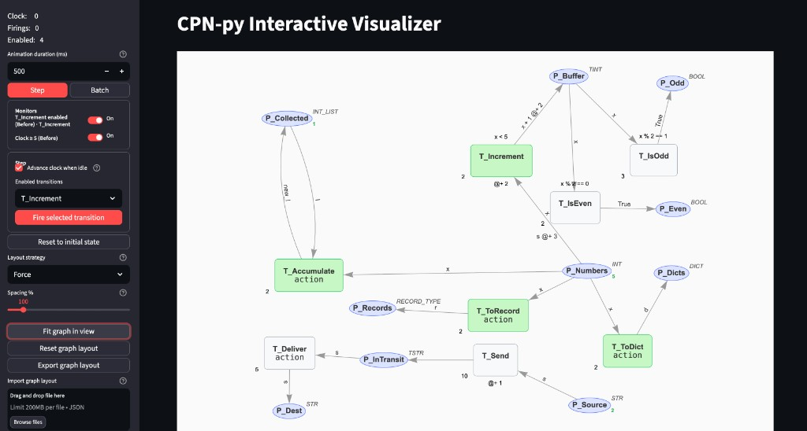

# cpn-py features user guide (since 30528abf)

This guide covers **user-facing features** added from commit `30528abf` onward: new CPN modeling capabilities, script simulation helpers, and the interactive Streamlit visualizer. It explains **what you can do and how**, not internal rerun mechanics.

For developer/refactoring notes on the Streamlit visualizer, see [Streamlit visualizer simplification patterns](docs/solutions/architecture-patterns/streamlit-visualizer-simplification-patterns.md).

## Quick start

**Try the demo (recommended first step):**

```bash
pip install -e ".[streamlit]"   # or install streamlit from requirements.txt
streamlit run examples/streamlit_demo.py
```

The demo builds a small net with integers, strings, timed places, records, lists, priorities, and action blocks. Two monitors are pre-registered so you can see pause/resume behavior immediately.

**Embed in your own Streamlit app:**

```python
from cpnpy.visualization.visualizer_st import CPNStreamlitVisualizer

viz = CPNStreamlitVisualizer(cpn, marking, context=context, session_key="my_marking")
viz.register_monitor("Clock >= 10", lambda cpn, m: m.global_clock >= 10, before=True)
viz.render(height=800)
```

The marking is stored in `st.session_state[session_key]` and survives reruns.

---

## Part 1 — CPN modeling features (Python)

These features let you build richer nets in code or `.cpn` files and run them in scripts or the visualizer.

### Transition priority

When several transitions are enabled at once, **lower numeric priority wins**.

```python
t_high = Transition("T_Fast", priority=1)   # fires first
t_low  = Transition("T_Slow", priority=10)  # waits until T_Fast cannot fire
```

- Default priority is `0`.
- The visualizer and `get_enabled_transitions(..., only_best_priority=True)` show only the best-priority enabled set.
- Tie-breaking in unattended script runs: `simulate_until_deadlock` picks randomly among equal-priority enabled transitions.

**Typical use:** separate urgent routing transitions from background bookkeeping in large models (e.g. DVRP nets).

### Action blocks

Attach Python to a transition to compute output-arc values that guards alone cannot express.

**String action** (most common):

```python
t = Transition(
    "T_ToRecord",
    variables=["x"],
    action="output['r'] = {'id': x, 'val': 'r_' + str(x)}",
)
```

Inside the action string:

- `input` — read bound input tokens (arc variables)
- `output` — write output variables used by output arcs (e.g. `output['r'] = ...`)
- Arc-bound names (`x`, `l`, …) are also in scope

**Callable action:**

```python
def my_action(inp, out):
    out["result"] = inp["x"] * 2

t = Transition("T_Double", variables=["x"], action=my_action)
```

Actions run **before** output arcs are evaluated. Output arc expressions can reference variables written to `output`.

See `examples/streamlit_demo.py` transitions `T_ToDict`, `T_ToRecord`, and `T_Accumulate` for working patterns.

### User code and module loading

Guards, arc expressions, and actions can call helpers you provide via `EvaluationContext`:

```python
# Inline string
context = EvaluationContext(user_code="""
def log_deliver(s):
    print(f"Delivering {s}")
""")

# Or import a module
import my_cpn_helpers
context = EvaluationContext(user_code=my_cpn_helpers)
```

Functions and variables from `user_code` become available in guard/action evaluation. Use this for logging, metrics, external API calls, or shared libraries across transitions.

### Record, list, and dict colorsets

Define structured token types with `ColorSetParser`:

```python
colorsets = parser.parse_definitions("""
    colset INT = int;
    colset STR = string;
    colset RECORD_TYPE = record id:INT * val:STR;
    colset INT_LIST = list INT;
    colset DICT = dict;
""")
```

- **Record** — fixed-field structs; tokens are dict-like with typed fields
- **List** — homogeneous lists (e.g. accumulate tokens in a place)
- **Dict** — dictionary-valued tokens

Initial marking uses Python values matching the colorset, e.g. `marking.set_tokens("P_Records", [{"id": 1, "val": "a"}])`.

### Input arc syntax

Arc expressions on input arcs support:

| Syntax | Meaning |
|--------|---------|
| `x` | Bind one token to variable `x` |
| `[x]` | Bind a list/multiset token |
| ``3`x`` | Multiset repetition (3 copies of binding) |

Parsed by `InputArcParser`; invalid syntax is caught when the visualizer validates the net at startup.

### Timed places and `@+` delays

Timed colorsets (`int timed`, `string timed`, …) track token availability by global clock. Output arcs can delay tokens:

```python
cpn.add_arc(Arc(t_send, p_in_transit, "s @+ 3"))  # token available 3 time units later
```

Transitions may also set `transition_delay=N` for transition-level timing. The sidebar **Advance clock when idle** checkbox (Step and Batch modes) controls whether the visualizer advances global time when no transition is enabled.

### Guard evaluation errors

If a guard raises an exception, the transition is treated as disabled and its name is recorded in `context.guard_error_names`. In the graph, such transitions appear **red**. Click the transition to open the detail overlay and inspect the guard expression; fix the model or user code accordingly.

### Net validation before simulation

Creating `CPNStreamlitVisualizer(cpn, marking, ...)` runs validation (`raise_if_invalid_net`): duplicate names, invalid initial tokens, bad arc syntax, unbound variables, etc. Errors appear in the main-area status panel before you can fire.

---

## Part 2 — Script simulation (no UI)

For batch runs from Python without Streamlit:

```python
from cpnpy.simulation.simu import get_enabled_transitions, simulate_until_deadlock

# Query what can fire now (respects priority by default)
enabled = get_enabled_transitions(cpn, marking, context)

# Run until deadlock or limits
final = simulate_until_deadlock(
    cpn, marking, context,
    max_steps=1000,      # default 1000
    max_time=100,        # optional global-clock cap
)
```

Behavior:

1. Repeatedly fires enabled transitions (best priority only; random tie-break)
2. When nothing is enabled, advances global clock for timed nets
3. Stops at deadlock, `max_steps`, or `max_time`

Prints step/time progress to stdout. Does not drive the Streamlit graph.

---

## Part 3 — Streamlit visualizer UI map

The demo opens with a **sidebar** (controls) on the left and the **interactive graph** on the right. Status messages appear in the main column above the graph when simulation events occur (errors, batch completion, monitor pause).



*Screenshot: `streamlit run examples/streamlit_demo.py` at initial load (Clock 0, Firings 0, Enabled 4). The full demo net is visible: integer flow (`P_Numbers` → `T_Increment` → `P_Buffer` → parity checks), string/timed flow (`P_Source` → `T_Send` → `P_InTransit` → `T_Deliver`), and action-block transitions (`T_ToDict`, `T_ToRecord`, `T_Accumulate`). Green boxes are enabled; gray boxes are disabled at this marking.*

### Layout at a glance

| # | Region | What you see | What it does |
|---|--------|--------------|--------------|
| 1 | **Metrics** (sidebar top) | `Clock`, `Firings`, `Enabled` | Live simulation stats in monospace text |
| 2 | **Animation duration** | Number input (default 500 ms) | Length of firing animations (Fire / animated batch) |
| 3 | **Step / Batch** | Two panel buttons | Switch between manual step mode and automated batch mode |
| 4 | **Monitors** | Named toggles with **On** | Enable/disable breakpoints registered in code |
| 5 | **Step controls** | Checkbox, transition selectbox, **Fire** | Manual firing (visible when Step panel is active) |
| 6 | **Reset** | **Reset to initial state** | Restore initial marking and clear pause/status state |
| 7 | **Layout** | Strategy, spacing, fit/reset/export/import | Control graph arrangement and persistence |
| 8 | **Tips** | Collapsed expander | Built-in cheat sheet |
| 9 | **Graph** (main area) | vis-network canvas | Places (ellipses), transitions (boxes), arcs, token badges |
| 10 | **Status** (main area, above graph) | Bordered banner with × dismiss | Errors, batch results, monitor pause — appears when relevant |

### Sidebar — top to bottom

#### Metrics

| Field | Meaning |
|-------|---------|
| **Clock** | Current global simulation time |
| **Firings** | Total transitions fired this session |
| **Enabled** | Count of currently enabled transitions (after priority filter) |
| **Last fired** | Name of the most recent transition (caption below metrics when set) |

In the screenshot, **Enabled: 4** means four transitions pass the guard and priority filter; the selectbox lists them for manual firing.

#### Step / Batch panel switch

Click **Step** or **Batch** at the top of the control stack. The active panel is highlighted (red in the demo theme). Only one panel's controls are shown at a time — after a batch monitor pause, switch back to **Step** to use **Fire selected transition**.

#### Monitors (visible in screenshot)

Each registered monitor shows its name, timing (**Before** / **After**), optional transition filter, and an **On** toggle. The demo ships with:

- **T_Increment enabled (Before) · T_Increment** — pauses whenever `T_Increment` is about to fire
- **Clock ≥ 5 (Before)** — pauses when global clock reaches 5

Turn monitors **Off** to step without interruption. See [Part 4](#part-4--simulation-monitors-breakpoints) for the registration API.

#### Layout controls (below Reset)

| Control | Purpose |
|---------|---------|
| **Layout strategy** | Force, Flow LR, Cluster, or Layered LR |
| **Spacing %** | Slider 50–500%; applied on layout reset |
| **Fit graph in view** | Zoom/pan to fit all nodes |
| **Reset graph layout** | Recompute positions from strategy + spacing |
| **Export graph layout** | Download positions as JSON |
| **Import graph layout** | Upload a previously exported JSON file |

Scroll the sidebar to reach the **Tips** expander at the bottom.

### Main area — graph

The graph is an interactive iframe showing the full demo net. In the screenshot:

| Visual element | Meaning |
|----------------|---------|
| **Blue ellipse** | Place — name inside, colorset label (e.g. `INT`, `TINT`, `INT_LIST`) at top-right |
| **Green number on place** | Token count at current clock (`P_Numbers`: **5**, `P_Source`: **2**, `P_Collected`: **1**) |
| **Green box** | Enabled transition — can fire now (`T_Increment`, `T_ToDict action`, `T_ToRecord action`, `T_Accumulate action`) |
| **Gray / white box** | Disabled transition — guard fails or not enough tokens (`T_IsEven`, `T_IsOdd`, `T_Send`, `T_Deliver action`) |
| **`action` in label** | Transition has an action block (see Part 1) |
| **Text above box** | Guard expression (e.g. `x < 5`, `x % 2 == 0`) |
| **Text below box** | Output arc expression / delay (e.g. `x + 1 @ + 2`, `@ + 1`) |
| **Priority badge** | Bottom-left corner (e.g. `p:2`, `p:10`) |
| **Arc labels** | Input/output expressions (`x`, `new_l`, `s`, `d`, `r`, …) |
| **Pan / zoom / drag** | Mouse on canvas; drag nodes to reposition (positions persist) |

**Demo flows visible in the screenshot:**

- **Integer path:** `P_Numbers` (5 tokens) → `T_Increment` / `T_ToDict` / `T_ToRecord` / `T_Accumulate` → various output places
- **Timed buffer path:** `P_Buffer` ↔ `T_Increment` with `@ + 2` delay on output
- **Parity (disabled here):** `T_IsEven` / `T_IsOdd` need tokens in `P_Buffer` first
- **String path (disabled here):** `P_Source` (2 tokens) → `T_Send` → `P_InTransit` → `T_Deliver` → `P_Dest`

**Click a node** to open the detail overlay (full token list, guard, action source). **Click an enabled transition** in Step mode to select it for firing.

### Animation duration

Slider **Animation duration (ms)** — 50–5000, default 500. Controls how long firing animations play when you Fire manually or run batch with **Animate each step**. Disabled while a batch is running.

### Step mode — manual debugging

1. Open the **Step** panel.
2. Pick a transition from **Enabled transitions** (or click a green transition box on the graph).
3. Click **Fire selected transition**.
4. Optional: **Advance clock when idle** — when checked, time advances automatically when no transition is enabled.

**Graph click-to-select:** In Step mode, click an enabled (green) transition on the graph; the selectbox syncs on the next rerun.

### Batch mode — unattended runs

1. Open the **Batch** panel.
2. Choose **Mode:**
   - **Steps** — run until N transitions fire (0 = unlimited, hard cap 10,000)
   - **Time** — run until global clock reaches **Target time**
3. Optional: **Advance clock when idle (batch)**
4. Optional: **Animate each step** — show firing animation for each step (slower, easier to follow)
5. Click **Start batch**. The same button becomes **Stop batch** while running.

**Fast batch (no animation):** Runs several steps per page refresh so the UI stays responsive; **Stop** remains clickable between chunks.

**After batch finishes:** Status appears in the main **Status** area (e.g. Finished, Deadlock, Stopped).

### Reset

**Reset to initial state** restores the marking from when the visualizer was first created, clears batch/monitor pause state, and clears notifications. Disabled during an active batch.

### Tips expander

Built-in cheat sheet for Step vs Batch, green boxes, layout controls, and monitors. Collapsed by default at the bottom of the sidebar.

---

## Part 4 — Simulation monitors (breakpoints)

Monitors pause simulation when a Python predicate returns true. Register them **before** `render()`:

```python
viz.register_monitor(
    "Drive enabled",
    lambda cpn, marking: True,
    before=True,                      # check before firing (default)
    transition_name="execute_route.Drive",  # optional: only when this transition is pending
    default_enabled=True,
)
```

| Parameter | Effect |
|-----------|--------|
| `name` | Label in Monitors panel and status message |
| `predicate(cpn, marking)` | Return `True` to pause |
| `before=True` | Check before each fire attempt |
| `before=False` | Check after a successful fire |
| `transition_name` | Only evaluate when that transition is in the enabled set |
| `default_enabled` | Initial On/Off state for the toggle |

**Monitors panel:** Each registered monitor has an **On** toggle. Turn off to skip that monitor without removing it from code.

**When a monitor fires:** Simulation stops with a status like `Stopped (monitors: Clock >= 5)`. Batch mode pauses the same way.

**Resume:** Click **Fire selected transition** (Step tab) or **Start batch** again. The next action skips monitor checks **once**, then monitors stay active. You do not need to disable monitors to continue.

The demo registers `"T_Increment enabled"` (always true before `T_Increment`) and `"Clock >= 5"` — toggle them off in the Monitors panel if you want uninterrupted stepping.

---

## Part 5 — Status messages (main area)

Important messages appear **above the graph** in a bordered Status section (not buried in the sidebar):

| Message type | Typical cause |
|--------------|---------------|
| Error (red) | Simulation exception, invalid net |
| Warning (yellow) | User stopped batch, manual stop |
| Success (green) | Batch finished, monitor pause |
| Info (blue) | Deadlock notice, general info |

- Click **×** to dismiss a message. It stays hidden until the underlying text changes (e.g. new error).
- Tracebacks use a collapsed **Error details** expander.

Metrics (Clock / Firings / Enabled) remain in the sidebar.

---

## Part 6 — Interactive graph

### Reading the graph

| Element | Meaning |
|---------|---------|
| **Ellipse (place)** | Place name inside; colorset label top-right |
| **Green number on place** | Available token count (timed: also shows future tokens) |
| **Box (transition)** | Name inside; guard above; `@+ delay` below; priority bottom-left |
| **Green box** | Enabled (can fire) |
| **Gray box** | Disabled |
| **Red box** | Guard evaluation error |
| **Edge labels** | Arc expressions; curved when bidirectional |

### Detail overlay

Click any place or transition to open an overlay with full token lists (values and timestamps for timed tokens), guard text, delay, priority, and action source.

### Firing animation

After Fire or animated batch step: tokens animate **into** the transition, pause, then **out** to output places. Arcs with many tokens show a count badge instead of drawing every token.

---

## Part 7 — Graph layout

Sidebar layout controls:

| Control | What it does |
|---------|--------------|
| **Layout strategy** | **Force** (physics), **Flow LR** (left-to-right flow), **Cluster** (group by module prefix), **Layered LR** (hierarchical layers, good for large HCPN nets with dotted names) |
| **Spacing %** | 50–500% density; applied on reset |
| **Reset graph layout** | Recompute positions from strategy + spacing; clears saved positions |
| **Fit graph in view** | Zoom/pan to fit all nodes (does not move nodes) |
| **Export graph layout** | Download JSON `{version: 1, positions: {node_id: {x, y}}}` |
| **Import graph layout** | Upload a previously exported JSON; unknown node IDs are ignored |

**Manual drag:** Drag nodes on the graph; positions persist across reruns (session + browser storage keyed by net topology).

**Large hierarchical nets:** Names like `module.submodule.Place` auto-group under **Cluster** / **Layered LR** using the top-level module segment.

---

## Part 8 — Typical workflows

### Debug one transition at a time

1. Run demo or your app.
2. Step panel → select transition → Fire.
3. Watch graph animation and metrics.
4. Use monitors to pause before suspicious transitions.

### Run many steps unattended

1. Batch panel → Steps mode → set max transitions (or 0 for unlimited).
2. Leave **Animate each step** off for speed; turn on to watch each firing.
3. Use **Stop batch** if you need to intervene.

### Run until a time horizon

1. Batch panel → Time mode → set **Target time** ≥ current Clock.
2. Start batch; simulation fires and advances clock until target or deadlock.

### Save a readable layout for a large net

1. Try **Layered LR** or **Cluster** for HCPN-style names.
2. Adjust **Spacing %** → **Reset graph layout**.
3. Drag nodes to fine-tune → **Export graph layout** for reuse or sharing.

### Integrate with svm_dvrp or custom models

1. Build `CPN`, `Marking`, `EvaluationContext` as today.
2. Pass them to `CPNStreamlitVisualizer`.
3. Register monitors for domain checkpoints (e.g. before `Drive`, before `WriteMetrics`).
4. Use `session_key` unique per net instance if multiple visualizers coexist.

---

## Examples reference

| Example | Location |
|---------|----------|
| Full demo net (priority, actions, timed, record/list) | `examples/streamlit_demo.py` |
| Priority filtering | `test/cpn/test_priority.py` |
| Action blocks | `test/cpn/test_execute_action.py` |
| Module user code | `test/cpn/test_module_user_code.py` |
| Record/list types | `test/cpn/test_types.py` |
| Script simulation | `cpnpy/simulation/simu.py` (`if __name__ == "__main__"` block) |

---

## Related

- Developer patterns: [streamlit-visualizer-simplification-patterns.md](docs/solutions/architecture-patterns/streamlit-visualizer-simplification-patterns.md)
- Domain vocabulary: [CONCEPTS.md](CONCEPTS.md)
- Batch simulation plan: `docs/plans/2026-05-28-001-feat-streamlit-batch-simulation-plan.md`
- Status messages plan: `docs/plans/2026-06-04-003-feat-main-area-status-messages-plan.md`
- Graph layout plan: `docs/plans/2026-06-04-002-feat-graph-layout-persistence-plan.md`
- Layout strategies plan: `docs/plans/2026-06-03-001-feat-graph-layout-strategies-plan.md`
